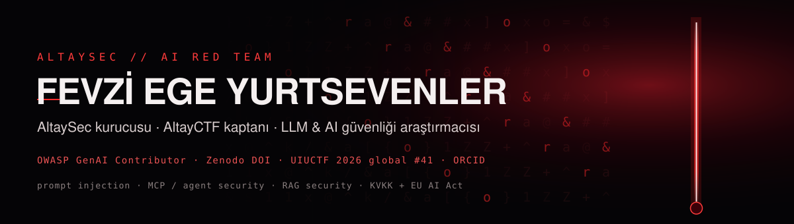

  

### `> whoami`

**Türkiye'de yapay zekâ güvenliği alanında açık kaynak üreten ve topluluk kuran
araştırmacı.** Klasik siber güvenlik mühendisliğinden geldim; 2024'ten beri tek
odağım **dil modellerini ve ajanları kırmak — ve savunmak.** 2025'te AI güvenliğine
odaklanan **[AltaySec](https://altaysec.com.tr)**'i kurdum.

I red-team language models and AI agents: **prompt injection, MCP / tool poisoning,
RAG attacks, and the invisible-Unicode supply chain.** Then I ship the open-source
tools to defend against them — **Turkish-first, because non-English attacks walk
right through English-only filters.**

Topluluk tarafında üç çatı: **[LLM-Security-Turkiye](https://github.com/fevziegeyurtsevenler/LLM-Security-Turkiye)** — Türkçe ekosistem hub'ı · **[awesome-ai-security-tr](https://github.com/fevziegeyurtsevenler/awesome-ai-security-tr)** — Türkçe AI güvenlik kaynak listesi (300+ doğrulanmış kaynak) · **[turkce-siber-guvenlik-kaynaklari](https://github.com/fevziegeyurtsevenler/turkce-siber-guvenlik-kaynaklari)** — TÜGA Siber Güvenlik Komitesi ile büyüyen, CI'yla doğrulanan dizin.

---

### ⚡ Live — try it right now

| | |
|---|---|
| 🕵️ **[uncloak — in your browser](https://fevziegeyurtsevenler.github.io/uncloak/)** | Paste a `SKILL.md` / MCP config and watch a hidden instruction appear. Zero install. |
| 🍯 **[ai-honeypot — live attack console](https://fevziegeyurtsevenler.github.io/ai-honeypot/)** | A dashboard of attacks sent to a decoy AI agent. |
| 🧭 **[ATLAS Labs](https://fevziegeyurtsevenler.github.io/altaysec-atlas/)** | Bilingual MITRE ATLAS matrix + in-browser attack simulations. |
| 🧪 **[Açık Kaynak Lab](https://altaysec.com.tr/acik-kaynak)** | Open-source tools, one page. |
| 🤗 **[Hugging Face](https://huggingface.co/fevziegeyurtsevenler)** | 24 datasets · 6 Spaces · a multilingual injection detector (F1 ≈ 0.96, n=75 held-out). |

---

### 🇹🇷 OWASP 2026 — Türkçe editions

*Unofficial community editions of the OWASP LLM & Agentic Top 10 2026 — shipped the same day as the Aug 4, 2026 release.*

| Repo | What it does for you |
|---|---|
| **[owasp-llm-top10-2026-tr](https://github.com/fevziegeyurtsevenler/owasp-llm-top10-2026-tr)** | LLM Top 10 2026 — Türkçe + machine-readable edition, 2025→2026 change map. |
| **[owasp-agentic-top10-2026-tr](https://github.com/fevziegeyurtsevenler/owasp-agentic-top10-2026-tr)** | Agentic Top 10 2026 (ASI01–ASI10) — Türkçe + machine-readable, mapped to MITRE ATLAS. |
| **[llm-top10-2026-selfcheck](https://github.com/fevziegeyurtsevenler/llm-top10-2026-selfcheck)** · [live](https://huggingface.co/spaces/fevziegeyurtsevenler/llm-top10-2026-selfcheck) | Interactive LLM01–LLM10 self-assessment (TR/EN). |
| **[agentic-top10-selfcheck](https://github.com/fevziegeyurtsevenler/agentic-top10-selfcheck)** · [live](https://huggingface.co/spaces/fevziegeyurtsevenler/agentic-top10-selfcheck) | Interactive ASI01–ASI10 self-assessment, MITRE ATLAS-mapped (TR/EN). |

---

### 🗡️ The arsenal — 60+ repos · 25+ security tools

**Tools & data**
| Repo | What it does for you |
|---|---|
| **[uncloak](https://github.com/fevziegeyurtsevenler/uncloak)** | Reveal hidden prompt injection in Skills / MCP / rules files. Multilingual, SARIF, zero-dep — plus a [drop-in CI action](https://github.com/fevziegeyurtsevenler/agent-security-ci). |
| **[skills-in-the-wild](https://github.com/fevziegeyurtsevenler/skills-in-the-wild)** | Open audit of **3,168** real agent extensions — dataset + findings + method. |
| **[ai-honeypot](https://github.com/fevziegeyurtsevenler/ai-honeypot)** | A decoy that captures & classifies attacks on AI agents (+ live dashboard). |
| **[prompt-injection-corpus](https://github.com/fevziegeyurtsevenler/prompt-injection-corpus)** | Multilingual injection techniques — each paired with its defense. |
| **[prompt-injection-detection-rules](https://github.com/fevziegeyurtsevenler/prompt-injection-detection-rules)** | 20 portable detection rules (regex+YAML) for guardrails/WAFs. |
| **[hf-dataset-scan](https://github.com/fevziegeyurtsevenler/hf-dataset-scan)** | Scan any dataset for smuggled prompt-injection — HF or JSONL, CI gate. |
| **[lethal-trifecta-lint](https://github.com/fevziegeyurtsevenler/lethal-trifecta-lint)** | Lint an agent's tool manifest for the lethal trifecta (Simon Willison). |
| **[turkish-pii-redactor](https://github.com/fevziegeyurtsevenler/turkish-pii-redactor)** | Checksum-validated Turkish PII (TCKN/IBAN/VKN) redaction + [KVKK browser demo](https://fevziegeyurtsevenler.github.io/turkish-pii-redactor/). |

**Benchmarks & Turkish guard evaluations** *(each finding is a bounded probe, not a census)*
| Repo | Finding |
|---|---|
| **[guardrail-arena](https://github.com/fevziegeyurtsevenler/guardrail-arena)** · [live board](https://fevziegeyurtsevenler.github.io/guardrail-arena/) | Two-axis EN+TR guardrail benchmark — miss-rate **and** over-refusal. |
| **[turkish-llm-guardrail-set](https://github.com/fevziegeyurtsevenler/turkish-llm-guardrail-set)** | Community benchmark: TR injection + over-refusal pairs, one PR = one case, CI KVKK gate. |
| **[turkish-over-refusal-set](https://github.com/fevziegeyurtsevenler/turkish-over-refusal-set)** | ProtectAI over-refuses **59%** of benign Turkish prompts vs **0.8%** English. |
| **[guard-blindspots-tr](https://github.com/fevziegeyurtsevenler/guard-blindspots-tr)** | One popular open guard misses **85%** of Turkish injections; others are robust. |
| **[turkish-casefold-evasion](https://github.com/fevziegeyurtsevenler/turkish-casefold-evasion)** | `İGNORE`.lower() ≠ `ignore` → **94.6%** bypass of naive filters + one-line fix. |

**Skills, labs & playbooks**
| Repo | What it does for you |
|---|---|
| **[llm-security-skills](https://github.com/fevziegeyurtsevenler/llm-security-skills)** | 7 Agent Skills that turn your coding agent into an LLM security reviewer. |
| **[damn-vulnerable-agent-skill](https://github.com/fevziegeyurtsevenler/damn-vulnerable-agent-skill)** | 8 deliberately-vulnerable scenarios to learn agent attacks hands-on. |
| **[llm-red-team-playbook](https://github.com/fevziegeyurtsevenler/llm-red-team-playbook)** | Scope → threat model → OWASP LLM Top 10 test matrix → report. |

**Guides, compliance & curation**
| Repo | What it does for you |
|---|---|
| **[mcp-security-checklist](https://github.com/fevziegeyurtsevenler/mcp-security-checklist)** · **[owasp-agentic-skills-top10-tr](https://github.com/fevziegeyurtsevenler/owasp-agentic-skills-top10-tr)** | Harden MCP; OWASP Agentic Skills Top 10 in Turkish. |
| **[kvkk-ai-compliance-kit](https://github.com/fevziegeyurtsevenler/kvkk-ai-compliance-kit)** · **[eu-ai-act-technical-checklist](https://github.com/fevziegeyurtsevenler/eu-ai-act-technical-checklist)** | KVKK + EU AI Act, as engineering checklists. |
| **[ai-security-glossary](https://github.com/fevziegeyurtsevenler/ai-security-glossary)** · **[awesome-agent-supply-chain-security](https://github.com/fevziegeyurtsevenler/awesome-agent-supply-chain-security)** | Bilingual glossary + curated agent supply-chain list. |

---

### 🎖️ Receipts

- **[OWASP GenAI Security Project](https://genai.owasp.org/)** — Turkish prompt-injection & data-exfiltration test cases **[merged](https://github.com/GenAI-Security-Project/GenAI-Data-Security-Initiative/pull/8)** into the GenAI Data Security Initiative (2026) · Unicode case-folding guidance **[merged](https://github.com/OWASP/www-project-ai-security-and-privacy-guide/pull/192)** into the OWASP AI Security & Privacy Guide.
- **Research** — [DOI 10.5281/zenodo.20681557](https://doi.org/10.5281/zenodo.20681557) · *AltayDuel: a Turkish-first arena & open dataset for multi-turn LLM prompt-injection red-teaming* (CC-BY-4.0) · [ORCID 0009-0008-6518-8944](https://orcid.org/0009-0008-6518-8944).
- **Upstream** — open PRs bringing Turkish-locale fixes to [Presidio](https://github.com/data-privacy-stack/presidio/pull/2208), [promptfoo](https://github.com/promptfoo/promptfoo/pull/10244) and [garak](https://github.com/NVIDIA/garak/pull/1997).
- **CTF** — captain of **[AltayCTF](https://ctf.altaysec.com.tr)** · **#41 global** at [UIUCTF 2026](https://2026.uiuc.tf/scoreboard) (2,426 pts).
- **Teaching** — LLM Security training at **Gazi University** (with GaziCyber, 2026) · **[LLM Security Akademi](https://ai.altaysec.com.tr)** — free Turkish curriculum mapped to OWASP + MITRE ATLAS.
- **Programs** — Türkiye **Siber Vatan** · **BlueDot Impact** — *Future of AI* (2026).

---

  
  
  

Kırmızı takım gibi saldırır, mavi takım gibi savunur. · Ankara, Türkiye

